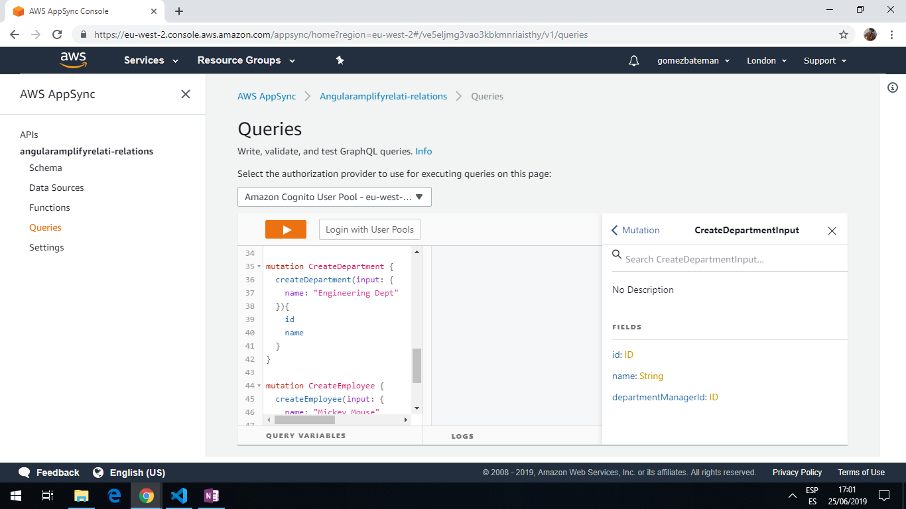
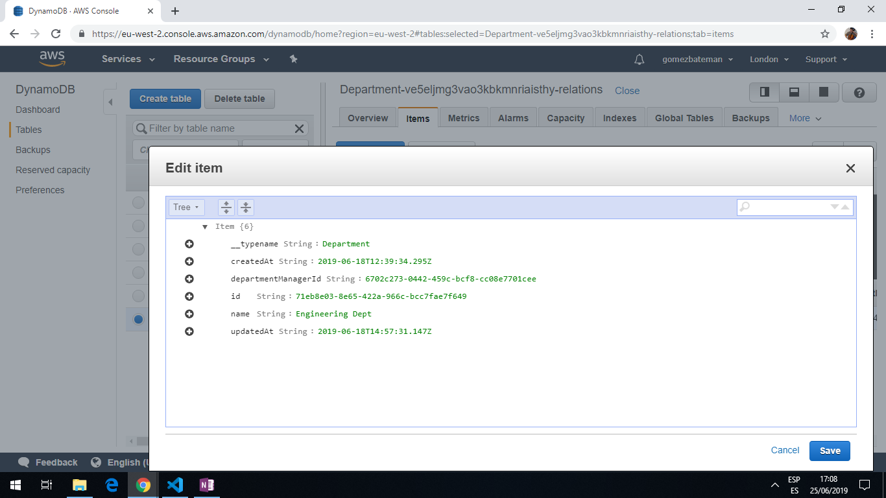
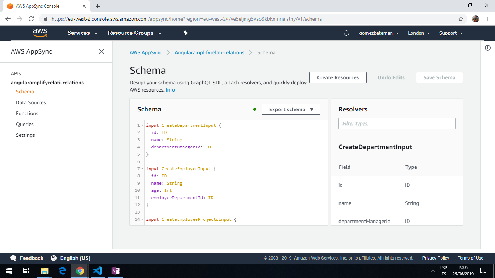

# Angular Amplify Relation

* App using Angular 8 with AWS amplify and Appsync to create relationships in a GraphQL database stored on a serverless AWS backend.

* An example is used of Departments, Employees and Projects to create one-one, one-many and many-many relationships between database items.

*** Note: to open web links in a new window use: _ctrl+click on link_**

## Table of contents

* [General info](#general-info)
* [Screenshots](#screenshots)
* [Technologies](#technologies)
* [Setup](#setup)
* [Features](#features)
* [Status](#status)
* [Inspiration](#inspiration)
* [Contact](#contact)

## General info

* [AWS Amplify](https://aws.amazon.com/amplify/?nc1=h_ls) makes it easy to create, configure, and implement scalable mobile and web apps powered by AWS. It provides a framework to integrate the backend with iOS, Android, Web, and React Native frontends. It allows you to select the capabilities needed, e.g. authorization, analytics or offline data sync.

* Within AWS Appsync it is necessary to 'log in with user pools' so a clientID, username and password are required. A user is created in the Userpool then the 'App Clientid' is copied from 'App Clients'. Once authorized mutations can be created.

* DynamoDB is used in the AWS Console to view the tables

* Cognito authorization is used to register and login users.

## Screenshots





## Technologies

* [Angular v8.0.0](https://angular.io/)

* [Angular CLI v8.0.1](https://cli.angular.io/).

* [aws-amplify v1.1.29](https://www.npmjs.com/package/aws-amplify) core Javascript library. [Documentation](https://aws-amplify.github.io/docs/js/start?platform=purejs)

* [aws-amplify-angular v3.0.4](https://www.npmjs.com/package/aws-amplify-angular) AWS Amplify library package, with building blocks for Angular App development.

## Setup

Run `ng serve` for a dev server. Navigate to `http://localhost:4200/`. The app automatically reloads if you change any of the source files.

## Code Examples

* `schema.graphql` extract showing Employee and EmployeeProjects entities. Named entities are used to allow 1 to many relationships.

```graphql
type Department @model{
  id: ID!
  name: String
  manager: Employee @connection
  employees: [Employee] @connection(name: "DepartmentEmployees")
}

type Employee @model{
  id: ID!
  name: String
  age: Int
  department: Department @connection(name: "DepartmentEmployees")
  projects: [EmployeeProjects] @connection(name: "EmployeeProjects")
}
```

* `schema.graphql` extract showing EmployeeProjects and Project entities. Named entities are used to allow many to many relationships.

```graphql
type EmployeeProjects @model (queries: null){
  id: ID!
  employee: Employee @connection(name: "EmployeeProjects")
  project: Project @connection(name: "ProjectEmployees")
}

type Project @model{
  id: ID!
  name: String
  employees: [EmployeeProjects] @connection(name: "ProjectEmployees")
}

```

## Features

* The AWS Amplify push process creates a ./src/graphql folder structure and generates a new api in the AWS Appsync Console.

## Status & To-Do List

* Status: Working.

* To-Do: Explore AWS Amplify further.

## Inspiration

* [AWS AppSync Tutorial - GraphQL APIs with AppSync, Amplify and Angular - 2nd part, from 26:23](https://www.youtube.com/watch?v=QEMfnr5MO1w)

## Contact

Repo created by [ABateman](https://www.andrewbateman.org) - feel free to contact me!
